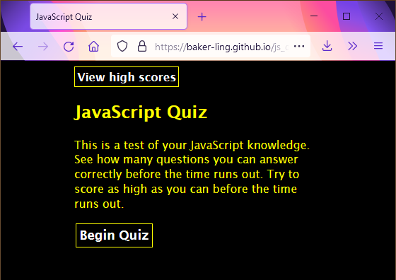

# JavaScript Quiz by Brian Baker
This is a simple app to quiz on JavaScript knowledge. It is built with HTML, CSS, and vanilla JavaScript.

The game starts at the welcome screen.

Currently the game has seven questions that it asks in random order, and you are given 10 seconds per question, 70 total, to complete the quiz. Don't be careless; wrong answers cost you 10 seconds.

The game ends when you run out of time or complete all the questions. You get 5 points for each correct answer and half a point for each second you had to spare (but only if you got at least 1 question right).

You can also register your score on the leaderboard to keep track of the best player on your computer.

You can play the game [here](https://baker-ling.github.io/js_quiz/index.html).